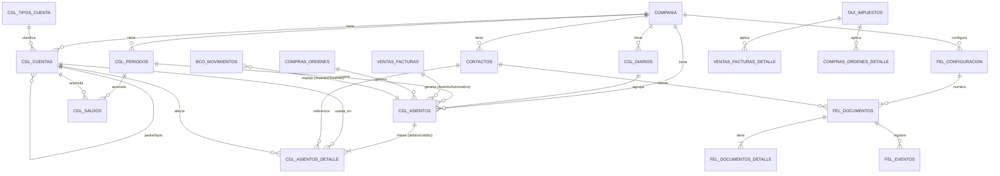

# Modelo de datos

Documenta las tablas, columnas y relaciones del sistema, a partir de
`database/migrations` y `app/Models`.

> ⚠ **Lectura imprescindible.** El repositorio tiene **~29 migraciones** pero
> **~180 modelos**. Muchas tablas se crean con guardas `if (! Schema::hasTable())`
> y comentarios que dicen que en dev/prod "ya existen en el esquema maestro". Por
> eso **este documento describe con detalle de columnas solo las tablas presentes
> en las migraciones**; para el resto se documenta el modelo y su tabla, pero la
> definición exacta de columnas está en el esquema maestro externo (ver
> `DECISIONES.md` → D-01). Donde una tabla no esté en las migraciones, se indica
> *(esquema maestro)*.

---

## 1. Convenciones generales

- Clave primaria `id` (bigint autoincremental).
- `compania_id` en casi todas las tablas (multi-compañía).
- `created_by` / `updated_by` (correo del usuario) para trazabilidad.
- `created_at` / `updated_at` (timestamps de Laravel).
- Importes monetarios en `decimal(18,2)`; cantidades en `decimal(18,4)`.
- Estados como cadenas en mayúsculas (`BORRADOR`, `POSTEADO`, `ANULADO`, etc.).

## 2. Núcleo contable (CGL)

Prefijo de tabla `cgl_`. Es el corazón del sistema.

### cgl_tipos_cuenta
Tipos de cuenta (naturaleza y sección). Columnas: `codigo` (único), `nombre`,
`naturaleza` (DEBITO/CREDITO), `seccion`.

### cgl_cuentas — modelo `CuentaContable`
Plan de cuentas por compañía.

| Columna | Tipo | Notas |
|---|---|---|
| compania_id | bigint | |
| codigo | string(50) | único junto con compania_id |
| nombre | string(200) | |
| cuenta_padre_id | bigint null | jerarquía (autorreferencia) |
| nivel | int | nivel en el árbol |
| tipo_cuenta_id | bigint null | → cgl_tipos_cuenta |
| naturaleza | string(10) | DEBITO / CREDITO |
| permite_movimiento | bool | solo las hojas permiten asientos |
| requiere_contacto | bool | exige contacto en el detalle |
| requiere_centro_costo | bool | |
| requiere_proyecto | bool | |
| conciliable | bool | cuentas bancarias/conciliables |
| activa | bool | |
| renglon_isr | string(20) null | mapeo a renglón del formulario ISR (DGI) |

Relaciones: `padre()`, `hijos()` (autorreferencia), `tipo()`.

### cgl_diarios — modelo `Diario`
Diarios contables. Columnas: `codigo`, `nombre`, `tipo_diario`,
`cuenta_default_id`, `requiere_aprobacion`, `activo`.

### cgl_periodos — modelo `PeriodoContable`
Períodos contables mensuales. Columnas: `anio`, `mes` (1–13; **13 = período de
ajuste/cierre**), `fecha_inicio`, `fecha_fin`, `estado` (ABIERTO/…), `cerrado_por`,
`fecha_cierre`. Único por `compania_id + anio + mes`.

### cgl_asientos — modelo `Asiento`
Cabecera del asiento contable.

| Columna | Tipo | Notas |
|---|---|---|
| compania_id | bigint | |
| periodo_id | bigint null | asignado/validado por trigger |
| diario_id | bigint null | |
| numero | string(50) | `AS-NNNNNN`, único por compañía |
| fecha | date | |
| descripcion | text null | |
| referencia | string(100) null | |
| estado | string(30) | BORRADOR / POSTEADO / ANULADO |
| origen_modulo | string(50) null | módulo que lo generó (CxC, CxP, CIERRE_ANUAL…) |
| origen_tabla / origen_id | | documento que lo originó |
| total_debito / total_credito | decimal(18,2) | deben coincidir con el detalle |
| usuario_id / posteado_por | bigint | |
| fecha_posteo | timestamptz null | |

Relaciones: `detalle()`, `diario()`, `periodo()`, `posteadoPor()`. Observado por
`AsientoObserver`.

### cgl_asientos_detalle — modelo `AsientoDetalle`
Líneas del asiento (partida doble).

| Columna | Tipo | Notas |
|---|---|---|
| asiento_id | bigint | |
| linea | int | único por asiento |
| cuenta_id | bigint | → cgl_cuentas |
| contacto_id | bigint null | requerido en cuentas con `requiere_contacto` |
| descripcion | text null | |
| debito / credito | decimal(18,2) | una línea es débito **o** crédito |
| moneda_id | bigint null | |
| tasa_cambio | decimal(18,8) | 1 si es moneda local |
| debito_local / credito_local | decimal(18,2) | importes en moneda local |
| conciliado | bool | |

### cgl_saldos
Saldos acumulados por período/cuenta (para reportes y cierre). Columnas:
`compania_id`, `periodo_id`, `cuenta_id`, `contacto_id`, `centro_costo_id`,
`debito`, `credito`, `saldo`.

### cgl_cierres — modelos `CglCierre` / `CglCierreDetalle`
Registro de cierres de período *(migración `2026_06_14_000004`)*.

## 3. Fiscal / FEL

### fel_configuracion — modelo `FelConfiguracion`
Configuración del PAC por compañía. Columnas: `compania_id` (único), `ambiente`
(PRUEBAS/PRODUCCION), `proveedor`, **`token_empresa`** y **`token_password`**
(cifrados con cast `encrypted`), `punto_facturacion` (default `001`),
`codigo_sucursal` (default `0000`), `correlativo` (consecutivo fiscal), `activa`.

### fel_documentos — modelo `FelDocumento`
Documentos electrónicos emitidos. Columnas: `tipo_documento`, `documento_origen`,
`documento_id`, `numero`, `fecha`, `cliente_id`, `subtotal`, `itbms`, `total`,
`estado_fel` (PENDIENTE/AUTORIZADO/RECHAZADO/ANULADO), **`cufe`**, `qr`,
`xml_path`, `pdf_path`.

### fel_documentos_detalle — modelo `FelDocumentoDetalle`
Líneas: `linea`, `descripcion`, `cantidad`, `precio_unitario`, `impuesto_monto`,
`total_linea`.

### fel_eventos
Bitácora de cada interacción con el PAC por documento: `evento` (ENVIO, ANULACION…),
`descripcion`, `respuesta` (JSON del PAC), `created_by`.

### tax_impuestos — modelo `TaxImpuesto`
Catálogo de impuestos. Columnas: `compania_id` (null = global), `codigo`, `nombre`,
`tipo` (VENTAS…), `porcentaje` (decimal 8,4), `cuenta_debito_id`,
`cuenta_credito_id`, `activo`. Se siembran 4 tasas ITBMS globales: `ITBMS_0` (0),
`ITBMS_7` (7), `ITBMS_10` (10), `ITBMS_15` (15). Modelos relacionados:
`TaxTarifa`, `TaxRetencion`.

## 4. Contactos (clientes/proveedores)

Migración `2026_06_13_000001_cxc_cxp_tablas`:
- `contact_tipos` — tipos de contacto.
- `contact_contactos` — modelo `Contacto` (clientes/proveedores; campos como
  `identificacion`/RUC, `dv`, `razon_social`, `tipo_persona`, dirección, provincia,
  distrito, etc., usados por el FEL).
- `contact_contactos_tipos` — relación N:N contacto↔tipo.
- `core_cuentas_default` — modelo `CuentaDefault`: mapea "claves" contables
  (p. ej. `UTILIDADES_RETENIDAS`) a una cuenta concreta por compañía.

Modelos complementarios *(esquema maestro)*: `ContactDireccion`,
`ContactPersonaContacto`, `ContactCuentaBancaria`.

## 5. Ventas

Migración `2026_06_14_000002_create_ventas_tablas`:
`ventas_cotizaciones`, `ventas_cotizaciones_detalle`, `ventas_facturas`,
`ventas_facturas_detalle`. Modelos: `VentaCotizacion(+Detalle)`,
`VentaFactura(+Detalle)`, y *(esquema maestro)* `VentaNotaCredito`, `VentaRecibo`,
`VentaReciboDetalle`, `VentaVendedor`, `VentaComision`.

## 6. Compras

Migración `2026_06_15_000001_create_compras_tablas`:
`compras_ordenes(+_detalle)`, `compras_recepciones(+_detalle)`. Modelos:
`CompraOrden(+Detalle)`, `CompraRecepcion(+Detalle)`.

## 7. CxC / CxP

Documentos por cobrar/pagar (modelos `CxcDocumento(+Detalle)`, `CxcAplicacion`,
`CxpDocumento(+Detalle)`, `CxpAplicacion`). La migración
`2026_06_14_000002_cxp_factura_borrador` ajusta la restricción de `estado` de
`cxp_documentos` para incluir `BORRADOR`. Buena parte de estas tablas está en el
*(esquema maestro)*.

## 8. Bancos y Caja

- **Bancos** (migración `2026_06_20_000001_create_bco_tablas`): `bco_bancos`,
  `bco_cuentas`, `bco_movimientos`, `bco_depositos`. Modelos: `BcoBanco`,
  `BcoCuenta`, `BcoMovimiento`, `BcoDeposito`, `BcoCheque`, `BcoTransferencia`,
  `BcoConciliacion(+Detalle)`.
  > ⚠ Existe además una tabla legado `banco_cuentas` (migración `2026_06_12_000002`)
  > y el modelo `BancoCuenta`. Ver `DECISIONES.md` → D-08.
- **Caja** (migración `2026_06_16_000001_create_caja_tablas`): `caj_cajas`,
  `caj_movimientos`, `caj_vales`, `caj_reembolsos`, `caj_arqueos(+_detalle)`.

## 9. Inventario

Migración `2026_06_21_000001_create_inv_tablas`: `item_productos_servicios`,
`inv_almacenes`, `inv_existencias`. El resto del módulo está en el *(esquema
maestro)*: modelos `InvLote`, `InvSerie`, `InvMovimiento(+Detalle)`,
`InvAjuste`, `InvTransferencia`, `InvUbicacion`, más catálogo de ítems
(`ItemProducto`, `ItemCategoria`, `ItemPrecio`, `ItemUnidadMedida`). La compañía
define `metodo_costeo` (default `PROMEDIO`) y `permitir_stock_negativo`.

## 10. Activos Fijos (AFI)

Migración `2026_06_17_000001_create_afi_tablas`: `afi_categorias`,
`afi_ubicaciones`, `afi_activos`, `afi_depreciaciones`, `afi_bajas`,
`afi_movimientos`, `afi_revaluaciones`.

## 11. Presupuestos (Budget)

Migración `2026_06_18_000001_create_budget_tablas`: `budget_versiones`,
`budget_escenarios`, `budget_presupuestos`, `budget_presupuestos_detalle`.

## 12. Verticales

- **Propiedad Horizontal (PH)** (migración `2026_06_13_100001`): `ph_edificios`,
  `ph_propietarios`, `ph_unidades`, `ph_tipos_cuota`, `ph_cuotas`, `ph_pagos`.
- **Taller** (migración `2026_06_13_100002`): `taller_talleres`,
  `taller_sucursales`, `taller_areas`, `taller_tipos_equipo`, `taller_marcas`,
  `taller_modelos`, `taller_especialidades`, `taller_sintomas`,
  `taller_servicios_estandar`, `taller_checklist(+_detalle)`, `taller_tecnicos`,
  `taller_tecnico_especialidades`, `taller_configuracion`, `taller_equipos`,
  `taller_ordenes`. (Muchos otros modelos `Taller*` están en el esquema maestro.)
- **Educación (Edu)**: ~50 modelos `Edu*` (estudiantes, matrícula, calificaciones,
  cobros, comunicación…). *(Esquema maestro — no hay migración en el repositorio.)*

## 13. Seguridad y plataforma

- `users` (+ migración `2026_06_08_210000` que agrega `is_admin`, `is_active`).
- Tablas de spatie/permission (`2026_06_10_004405_create_permission_tables`):
  roles, permisos y sus pivotes (multi-compañía por "teams").
- `core_companias` (modelo `Compania`), `core_zonas`, `core_planes` — datos de la
  plataforma SaaS (planes, límites). ⚠ Conviven tablas legado `companias`/`zonas`.
- **Auditoría**: `audit_actividad` (modelo `AuditActividad`) y `audit_reaperturas`.
  Ver `seguridad-auditoria.md`.

## 14. Diagrama del modelo de datos (núcleo)

Diagrama simplificado del núcleo contable y su relación con los módulos. Es una
vista conceptual de las **relaciones principales**, no un esquema exhaustivo.

> ⚠ Para un diagrama exhaustivo (todas las tablas y columnas, incluidos
> inventario, activos y verticales) se requiere el **esquema maestro** externo.
