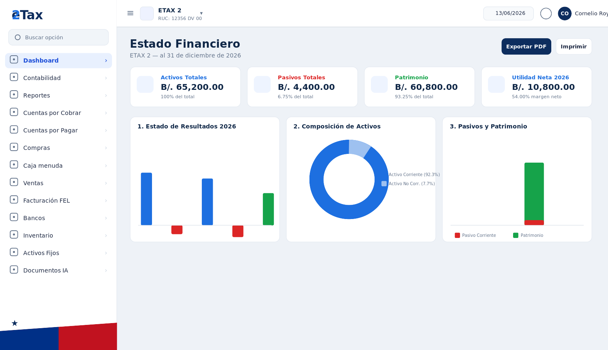
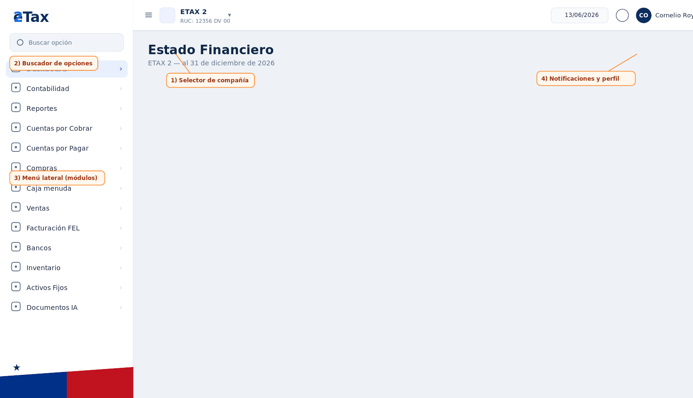
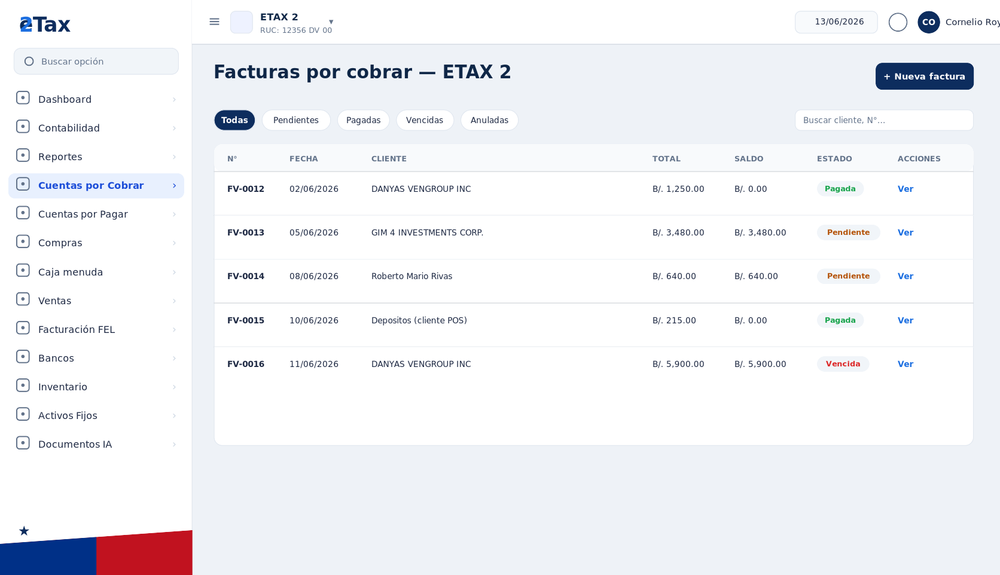
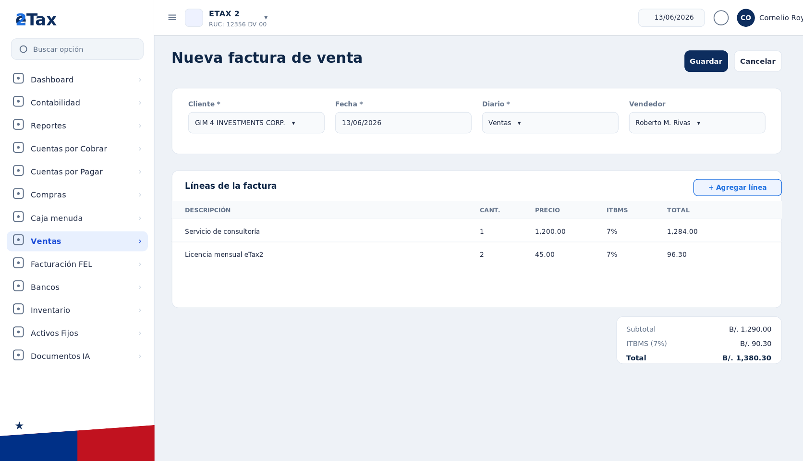
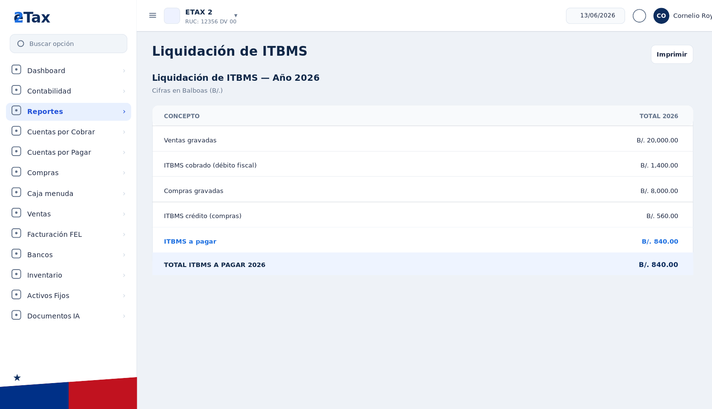
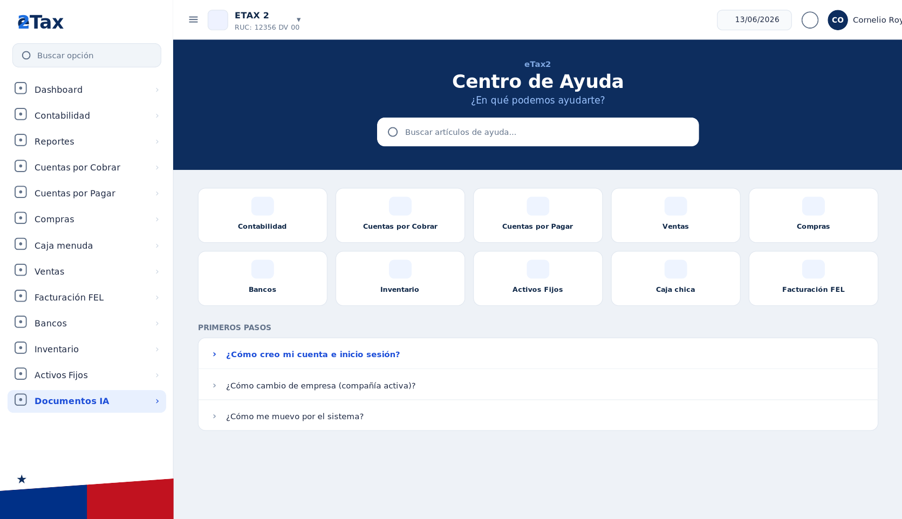

# Manual de Usuario — eTax2

**Sistema de Contabilidad y Facturación Electrónica (FEL) para Panamá**

Versión del manual: junio 2026 · Dirigido a usuarios finales (contribuyentes y personal administrativo)

> **Sobre las imágenes:** las pantallas de este manual son recreaciones fieles de la interfaz de eTax2 (compañía de ejemplo *ETAX 2*). Si quieres usar capturas reales, reemplaza los archivos de la carpeta `images/` conservando el mismo nombre; consulta `images/README_capturas.md` para saber qué pantalla corresponde a cada archivo.

---

## Índice

1. Introducción
2. Primeros pasos (acceso a la plataforma)
3. La pantalla principal (Dashboard y navegación)
4. Contabilidad
5. Cuentas por Cobrar (CxC)
6. Cuentas por Pagar (CxP)
7. Ventas
8. Compras
9. Caja menuda
10. Bancos
11. Inventario
12. Activos Fijos
13. Facturación Electrónica (FEL)
14. Reportes
15. Documentos IA
16. Administración (compañías, usuarios y permisos)
17. Configuración general
18. Centro de Ayuda integrado
19. Preguntas frecuentes y glosario

---

## 1. Introducción

eTax2 es un sistema en línea que reúne en un solo lugar la **contabilidad**, la **gestión de cobros y pagos**, las **ventas y compras**, el **inventario**, los **activos fijos** y la **facturación electrónica (FEL)** exigida por la Dirección General de Ingresos (DGI) de Panamá.

Su característica principal es que la mayoría de los documentos que registras (facturas, cobros, pagos, gastos, etc.) **generan automáticamente el asiento contable**, de modo que la contabilidad se mantiene al día sin tener que registrarla a mano.

eTax2 es **multiempresa**: con un mismo usuario puedes administrar varias compañías y cambiar entre ellas desde la barra superior. Lo que ves en cada módulo siempre corresponde a la compañía que tengas activa en ese momento.

> **Nota sobre permisos:** no todos los usuarios ven todos los módulos. Cada persona tiene permisos asignados por compañía (ver / gestionar). Si no ves una opción del menú, es porque tu usuario no tiene ese permiso; pídelo al administrador de tu empresa.

---

## 2. Primeros pasos (acceso a la plataforma)

### 2.1 Crear una cuenta

1. Entra a **https://etax2.com**.
2. Haz clic en **«Regístrate aquí»**.
3. Puedes registrarte de dos formas:
   - Con **correo y contraseña** (no necesitas Gmail), o
   - Con **«Entrar con Google»**.
4. Completa los datos solicitados y confirma. Recibirás un correo de verificación; ábrelo y confirma tu cuenta antes de iniciar sesión.

### 2.2 Iniciar sesión

1. En la página principal, ingresa tu **correo** y **contraseña**.
2. Marca **«Remember me»** si quieres mantener la sesión abierta en ese equipo.
3. Haz clic en **Log in**.

También puedes entrar directamente con el botón **«Entrar con Google»**.

### 2.3 Recuperar la contraseña

Si olvidaste tu contraseña, haz clic en **«Forgot your password?»**, ingresa tu correo y sigue el enlace que recibirás para crear una nueva contraseña.

### 2.4 Seleccionar / cambiar de compañía

En la parte superior izquierda aparece el nombre de la compañía activa y su **RUC**. Haz clic en ese nombre para desplegar la lista de compañías a las que tienes acceso y selecciona otra. Todo el sistema cambiará a esa empresa.

### 2.5 Tu perfil

Haz clic en tu nombre (esquina superior derecha) para acceder a tu **perfil**, donde puedes actualizar tu información personal, cambiar tu contraseña o eliminar tu cuenta.

---

## 3. La pantalla principal (Dashboard y navegación)

Al entrar verás el **Dashboard**, que muestra el **Estado Financiero** de la compañía activa: Activos Totales, Pasivos Totales, Patrimonio y Utilidad Neta del año, junto con gráficos de Estado de Resultados, Composición de Activos y Pasivos/Patrimonio.

> Si una compañía es nueva y aún no tiene asientos posteados, el dashboard mostrará el aviso *«… aún no tiene asientos posteados»* y los valores en B/. 0.00. Los gráficos se irán llenando a medida que registres y postees operaciones. Puedes **Exportar PDF** o **Imprimir** el estado financiero.

### Cómo moverte por el sistema

1. **Selector de compañía** (barra superior): cambia entre tus empresas.
2. **Buscador «Buscar opción»**: escribe el nombre de una pantalla para llegar rápido.
3. **Menú lateral izquierdo**: contiene todos los módulos; haz clic para desplegar sus opciones.
4. **Notificaciones y perfil** (barra superior derecha): campana de avisos y tu cuenta.

El botón **«Colapsar menú»** oculta el menú lateral para ganar espacio.

---

## 4. Contabilidad

El módulo de Contabilidad es la base del sistema. Aquí vive el plan de cuentas y los asientos que el resto de módulos genera automáticamente.

### 4.1 Plan de cuentas
*Contabilidad → Plan de cuentas*

Es la lista de cuentas contables de tu empresa, organizada por tipo (Activo, Pasivo, Capital, Ingreso, Gasto). Cada cuenta tiene un **código numérico** (por ejemplo `1-1-01`) y puede ser:

- **Cuenta padre (agrupadora):** solo suma a sus subcuentas, no recibe movimientos.
- **Cuenta detalle:** es donde realmente se registran los movimientos.

Solo las cuentas detalle aparecen disponibles al crear asientos. Si no tienes un plan de cuentas, el sistema te permite **aplicar una plantilla** base para empezar.

### 4.2 Cuentas por defecto
*Contabilidad → Cuentas por defecto*

Son las cuentas que el sistema usa automáticamente al generar asientos en cada módulo. Por ejemplo: **CXC** (clientes por cobrar), **CXP** (proveedores por pagar), **VENTAS** (ingresos), **ITBMS por pagar**.

> Si una cuenta por defecto no está configurada, el módulo correspondiente no podrá generar su asiento automático y mostrará un error. Configúralas antes de empezar a facturar.

### 4.3 Diarios
*Contabilidad → Diarios*

Los diarios clasifican los asientos por origen (Diario General, Ventas, Compras, Bancos, etc.). Puedes crear nuevos diarios y activarlos o desactivarlos.

### 4.4 Asientos
*Contabilidad → Asientos*

Para crear un asiento manual: **Nuevo asiento** → elige el **diario**, la **fecha** y agrega las líneas de **débito** y **crédito**. El asiento debe estar **cuadrado** (total débitos = total créditos) antes de guardarse. Acciones: **Postear** (confirma y refleja en los saldos) y **Anular** (revierte un asiento posteado).

> La mayoría de los asientos se generan solos desde Ventas, Compras, Bancos, Caja, etc. Usa el asiento manual solo para ajustes, provisiones o registros que no provienen de otro módulo.

### 4.5 Períodos contables
*Contabilidad → Períodos contables*

Un período es el rango de fechas (normalmente un mes) en el que se registran transacciones. **Solo se puede registrar dentro de un período abierto.** Puedes **cerrar** un período (impide nuevos registros) y, si es necesario, **reabrirlo**.

### 4.6 Cierre contable
*Contabilidad → Cierres*

El cierre traslada los saldos de las cuentas de resultado (ingresos y gastos) a la cuenta de utilidad o pérdida del ejercicio. Antes de cerrar, verifica que todos los documentos del período estén confirmados y que el balance cuadre. Una vez cerrado, el ejercicio no admite nuevos registros.

---

## 5. Cuentas por Cobrar (CxC)

Gestiona todo lo que tus clientes te deben.

### 5.1 Clientes
*Cuentas por Cobrar → Clientes*

**Nuevo cliente** → nombre, RUC/cédula, correo y teléfono. Puedes indicar una cuenta contable específica si difiere de la cuenta CXC por defecto. Un mismo contacto puede ser **cliente y proveedor** a la vez. En el detalle de cada contacto puedes registrar **direcciones, cuentas bancarias y personas de contacto** adicionales.

### 5.2 Facturas (CxC)
*Cuentas por Cobrar → Facturas*

**Nueva factura** → cliente, fecha, diario y líneas (descripción, cantidad, precio, ITBMS). Al confirmar, el sistema genera el asiento (débito CXC; crédito Ventas e ITBMS) y la factura queda **Pendiente** hasta cobrarse. Puedes filtrar el listado por estado y **anular** una factura registrada por error.

### 5.3 Cobros
*Cuentas por Cobrar → Cobros*

**Nuevo cobro** → cliente, fecha, monto y la cuenta de banco o caja donde recibes el dinero. En **«Documentos a aplicar»** seleccionas la(s) factura(s) que se cancelan. Asiento: débito Banco/Caja; crédito CXC.

### 5.4 Notas de crédito / débito
*Cuentas por Cobrar → Notas crédito/débito*

Una **nota de crédito** reduce el saldo de una factura (devoluciones, descuentos, correcciones); una **nota de débito** lo aumenta. Al confirmar, se genera el asiento correspondiente y se aplica contra la factura original.

### 5.5 Antigüedad de saldos
*Cuentas por Cobrar → Antigüedad de saldos*

Reporte que muestra cuánto te debe cada cliente agrupado por rango de días vencidos (0-30, 31-60, 61-90, +90). Útil para priorizar la cobranza.

### 5.6 Estado de cuenta
*Cuentas por Cobrar → Estado de cuenta*

Detalle de movimientos (facturas, cobros, notas) de un cliente en un rango de fechas, con su saldo. Ideal para enviárselo al cliente.

---

## 6. Cuentas por Pagar (CxP)

Gestiona todo lo que tu empresa debe a proveedores. Funciona en espejo con CxC.

- **Proveedores:** alta de proveedores (nombre, RUC, condiciones de pago).
- **Facturas por pagar:** registra la factura del proveedor; genera el asiento (débito Gasto/Compra e ITBMS crédito fiscal; crédito CXP).
- **Pagos:** selecciona proveedor, monto y banco de origen; aplica el pago a las facturas pendientes.
- **Notas crédito/débito**, **Antigüedad de saldos** y **Estado de cuenta** por proveedor.

---

## 7. Ventas

Módulo comercial: desde la cotización hasta el cobro.

### 7.1 Cotizaciones
*Ventas → Cotizaciones*

**Nueva cotización** → cliente, productos/servicios con precios y cantidades. La cotización **no genera asiento**. Puedes cambiar su **estado**, **anularla** o, cuando el cliente acepta, **Facturar** para convertirla en factura de venta.

### 7.2 Facturas de venta
*Ventas → Facturas de venta*

**Nueva factura** desde cero o convertida desde una cotización. Selecciona el cliente, agrega las líneas (descripción, cantidad, precio, ITBMS) y confirma; el asiento se genera automáticamente y se calcula el total con ITBMS. Puedes **anular** una factura emitida por error.

### 7.3 Recibos (cobros de venta)
*Ventas → Recibos*

**Nuevo recibo** → cliente y monto recibido; aplica el cobro a una o varias facturas pendientes. Asiento: débito Caja/Banco; crédito CXC.

### 7.4 Notas de crédito de venta
*Ventas → Notas de crédito*

Se crean desde una factura existente o desde cero. Indica el motivo (devolución, descuento, corrección) y los ítems/monto a acreditar.

### 7.5 Vendedores
*Ventas → Vendedores*

Registra a tu equipo de ventas para asociarlo a las facturas y medir su desempeño.

---

## 8. Compras

### 8.1 Órdenes de compra
*Compras → Órdenes de compra*

**Nueva orden** → proveedor e ítems con cantidades y precios estimados. Acciones: **Aprobar**, **Anular**, registrar **Recepciones** de mercancía y **Facturar** (convertirla en factura de proveedor). La orden no genera asiento.

### 8.2 Gastos directos
*Compras → Gastos directos*

Para egresos sin factura formal (servicios, transporte, papelería). **Nuevo gasto** → descripción, monto, cuenta de gasto y método de pago. Asiento: débito Gasto; crédito Caja o Banco.

---

## 9. Caja menuda
*Caja menuda*

Maneja el fondo de caja chica para gastos menores: **crear caja**, **movimiento** (gasto pagado con el fondo), **vale** (entrega pendiente de comprobante, que luego se **liquida**), **reembolso** (repone el fondo) y **arqueo** (conteo del efectivo). Cada operación genera su asiento contable.

---

## 10. Bancos

- **Cuentas bancarias:** banco, número, tipo (corriente/ahorro) y cuenta contable asociada.
- **Movimientos:** entradas/salidas manuales (comisiones, intereses, otros cargos).
- **Transferencias:** entre dos cuentas propias; crea egreso e ingreso con sus asientos.
- **Cheques:** número, beneficiario, monto; puede asociarse a un pago de proveedor.
- **Depósitos:** registra el ingreso de efectivo/cheques a una cuenta.
- **Conciliaciones:** compara los movimientos del sistema con el estado de cuenta del banco; marca los conciliados y cierra la conciliación.

---

## 11. Inventario

- **Productos / Ítems:** código, nombre, tipo (producto o servicio), cuentas y **lista de precios**.
- **Almacenes:** contenedores de stock; permiten consultar **existencias**.
- **Movimientos:** entrada / salida / ajuste de stock.
- **Transferencias:** mueven stock entre almacenes sin alterar el costo total.
- **Kardex:** historial cronológico de entradas y salidas de un producto con saldo acumulado; herramienta principal para auditar diferencias.

---

## 12. Activos Fijos

- **Registro de activos:** nombre, categoría, fecha de adquisición, costo y cuenta. La **categoría** define vida útil y método de depreciación.
- **Categorías y ubicaciones:** agrupan y localizan los activos.
- **Depreciar:** genera el asiento (débito Gasto por Depreciación; crédito Depreciación Acumulada).
- **Baja:** indica fecha, motivo y valor de rescate; reconoce ganancia/pérdida.
- **Revaluación:** ajusta el valor del activo desde su ficha.

---

## 13. Facturación Electrónica (FEL)

### 13.1 ¿Qué es FEL?

Es el sistema de la DGI de Panamá para emitir facturas con validez fiscal digital a través de un **Proveedor Autorizado de Certificación (PAC)**. eTax2 está integrado con **The Factory HKA**. Las facturas FEL incluyen **código QR** y **CUFE** y quedan registradas en la DGI en tiempo real.

### 13.2 Configuración
*Facturación FEL → Configuración*

Necesitas: **Token WS** y **contraseña WS** (de HKA), **código de sucursal** y **punto de facturación**, y el **RUC y DV** de tu empresa. Guarda y usa **Probar** para verificar la conexión antes de emitir documentos reales.

### 13.3 Emitir una factura
*Facturación FEL → Nueva factura*

Selecciona el cliente, agrega los ítems y confirma. eTax2 envía el documento a HKA en XML, HKA lo valida y reporta a la DGI, y devuelve el **CUFE** y el **QR**. Si la DGI lo rechaza, el sistema muestra el código y descripción del error para corregir y reintentar.

### 13.4 Documentos emitidos y anulación
*Facturación FEL → Documentos emitidos*

Lista de todos los documentos FEL. Desde aquí ves el **PDF** de cada documento y puedes **anular** uno cuando corresponda.

---

## 14. Reportes

*Reportes → …* Todos permiten imprimir/exportar.

- **Balance de Situación:** activos, pasivos y patrimonio a una fecha.
- **Estado de Resultado:** ingresos, costos y gastos de un período (utilidad/pérdida).
- **Comparativo Mensual:** evolución mes a mes de las cuentas.
- **Flujo de Efectivo:** entradas y salidas de dinero.
- **Liquidación de ITBMS:** resumen anual con Ventas gravadas, ITBMS cobrado, Compras gravadas, ITBMS crédito e ITBMS a pagar (cifras en Balboas). Base para tu declaración de ITBMS.

---

## 15. Documentos IA

Módulo asistido por inteligencia artificial para capturar documentos (por ejemplo, facturas recibidas) y dejarlos **«Por registrar»**. Permite conectar **Fuentes (Drive)** para procesar documentos automáticamente y agilizar la entrada de datos. *(Funcionalidad en evolución; algunas opciones pueden estar en preparación.)*

---

## 16. Administración (compañías, usuarios y permisos)

> Estas opciones suelen estar reservadas al dueño de la cuenta o al administrador.

- **Compañías → Directorio / Nueva compañía:** administra todas tus empresas (datos fiscales: RUC, DV, nombre).
- **Compañías → Zonas:** catálogo geográfico/comercial para clasificar clientes y operaciones.
- **Usuarios:** gestión global de usuarios de la plataforma.
- **Usuarios → Accesos por compañía:** define qué usuarios entran a cada compañía y edita sus **permisos** módulo por módulo:
  - **Ver:** puede consultar la información del módulo.
  - **Gestionar:** puede crear, editar, confirmar y anular documentos.

---

## 17. Configuración general
*Configuración*

Catálogos base que usan los demás módulos: **Sucursales** (código, nombre, dirección, teléfono), **Departamentos**, **Centros de costo**, **Proyectos** (con fecha de inicio), **Monedas** y **Tasas** de cambio, y **Retenciones**. Cada catálogo se administra con el botón **Agregar** y puede editarse o desactivarse.

---

## 18. Centro de Ayuda integrado

eTax2 incluye un **Centro de Ayuda** dentro del sistema con artículos organizados por categoría y un buscador. Es el lugar donde tus usuarios pueden resolver dudas sin salir de la plataforma.

---

## 19. Preguntas frecuentes y glosario

**No veo un módulo en el menú.** Tu usuario no tiene el permiso correspondiente para la compañía activa. Pídelo al administrador (sección *Accesos por compañía*).

**Error al guardar por «fecha fuera de período».** El período de esa fecha está cerrado o no existe. Ábrelo en *Contabilidad → Períodos contables*.

**El sistema dice que falta una cuenta por defecto.** Configúrala en *Contabilidad → Cuentas por defecto* antes de operar el módulo.

**¿Cómo cambio de empresa?** Con el selector de compañía en la barra superior izquierda.

### Glosario

- **RUC / DV:** identificación tributaria de la empresa y su dígito verificador.
- **ITBMS:** Impuesto a la Transferencia de Bienes Muebles y Servicios.
- **FEL:** Facturación Electrónica autorizada por la DGI.
- **CUFE:** Código Único de Factura Electrónica.
- **PAC:** Proveedor Autorizado de Certificación (en eTax2, The Factory HKA).
- **Asiento:** registro contable de débitos y créditos.
- **Postear:** confirmar un asiento para que afecte los saldos.
- **Kardex:** historial de movimientos de un producto en inventario.

---

*¿No encontraste lo que buscabas? Escribe a soporte@etax2.com.*
